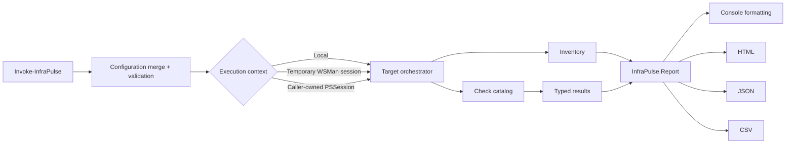

<p align="center">
  
</p>

<p align="center">
  <a href="https://github.com/xGreeny/infra-pulse/actions/workflows/ci.yml"></a>
  <a href="https://github.com/xGreeny/infra-pulse/releases"></a>
  
  <a href="LICENSE"></a>
</p>

# InfraPulse

**Read-only, on-demand health telemetry for Windows infrastructure.**

InfraPulse turns routine server validation into repeatable PowerShell checks, structured objects, and self-contained reports. It is designed for operational triage, maintenance windows, migration validation, and pre-change/post-change evidence—not as a replacement for continuous monitoring.

<p align="center">
  <a href="examples/sample-report.html"></a>
</p>

## What it does

- Runs ten built-in health checks against a local host or remote PowerShell sessions.
- Produces typed `InfraPulse.Report` and `InfraPulse.Result` objects instead of parsing console text.
- Applies role-specific thresholds from a validated PowerShell data file.
- Exports searchable, self-contained HTML with a restrictive content-security policy plus machine-readable JSON and CSV.
- Continues through individual check failures by default while preserving errors as `Unknown` results.
- Requires no third-party modules at runtime.
- Leaves target state unchanged.

## Quick start

```powershell
# Clone and import the module
# git clone https://github.com/xGreeny/infra-pulse.git
Import-Module .\src\InfraPulse\InfraPulse.psd1 -Force

# Run the core checks locally
$report = Invoke-InfraPulse -Check Disk, Memory, Uptime, PendingReboot

# Review the report and anything that needs attention
$report
$report.Results |
    Where-Object Status -NotIn 'Healthy', 'Skipped' |
    Format-Table Status, CheckName, Target, Message -AutoSize

# Build a self-contained dashboard
$report | Export-InfraPulseReport -Path .\out\infra-pulse.html -Force
```

A report stays useful after the console session ends:

```powershell
$report | Export-InfraPulseReport -Path .\out\infra-pulse.json -Force
$report | Export-InfraPulseReport -Path .\out\infra-pulse.csv -Force
```

## Built-in checks

| Check | Default | Platform | Evaluation |
|---|:---:|---|---|
| `Disk` | On | Windows | Fixed-volume free percentage and free GiB |
| `Memory` | On | Windows | Available physical memory percentage |
| `Uptime` | On | Windows | Time since the last operating-system boot |
| `PendingReboot` | On | Windows | Servicing, Windows Update, rename, and Configuration Manager indicators |
| `Services` | On | Windows | Required service existence and expected state |
| `Certificates` | On | Windows | Expired and expiring certificates in configured machine stores |
| `EventLog` | On | Windows | Recent critical/error volume, top providers, and optional samples |
| `Dns` | On | Cross-platform | Configured DNS names and record types; skipped until targets are defined |
| `Tcp` | On | Cross-platform | Configured host/port reachability; skipped until endpoints are defined |
| `TimeSync` | Off | Cross-platform | SNTP offset and round-trip time against configured NTP servers |

List the catalog directly from the module:

```powershell
Get-InfraPulseCheck
```

## Configuration as code

Generate a complete, documented configuration and validate it before execution:

```powershell
New-InfraPulseConfiguration -Path .\config\my-environment.psd1
Test-InfraPulseConfiguration -Path .\config\my-environment.psd1

Invoke-InfraPulse -ConfigurationPath .\config\my-environment.psd1
```

A compact role-specific override can remain small because it is merged with safe defaults:

```powershell
@{
    SchemaVersion = '1.0'

    General = @{
        DefaultChecks = @('Disk', 'Memory', 'Uptime', 'PendingReboot', 'Services', 'Dns', 'Tcp')
    }

    Checks = @{
        Disk = @{
            WarningFreePercent  = 18
            CriticalFreePercent = 8
            WarningFreeGB       = 30
            CriticalFreeGB      = 12
        }

        Services = @{
            Required = @(
                @{ Name = 'EventLog'; ExpectedStatus = 'Running'; Severity = 'Critical' }
                @{ Name = 'W32Time';  ExpectedStatus = 'Running'; Severity = 'Warning'  }
            )
        }

        Dns = @{
            Targets = @(
                'login.microsoftonline.com'
                @{ Name = '_ldap._tcp.dc._msdcs.contoso.invalid'; Type = 'SRV' }
            )
        }

        Tcp = @{
            Endpoints = @(
                @{ Name = 'Microsoft identity'; Host = 'login.microsoftonline.com'; Port = 443 }
                @{ Name = 'Domain controller LDAP'; Host = 'dc01.contoso.invalid'; Port = 389 }
            )
        }
    }
}
```

The complete schema and every threshold are documented in [`docs/configuration.md`](docs/configuration.md). Ready-to-adapt baselines are available under [`config/`](config/).

## Remote scans

InfraPulse can create temporary WSMan sessions:

```powershell
$credential = Get-Credential

$reports = Invoke-InfraPulse `
    -ComputerName 'srv-app-01', 'srv-file-01' `
    -Credential $credential `
    -UseSSL `
    -ConfigurationPath .\config\infra-pulse.example.psd1 `
    -Tag 'production', 'maintenance-window'

$reports | Export-InfraPulseReport -Path .\out\production-health.html -Force
```

It can also reuse caller-owned sessions. This keeps transport, authentication, session configuration, and lifecycle under the operator's control:

```powershell
$sessions = New-PSSession -ComputerName 'srv-app-01', 'srv-file-01' -Credential $credential
try {
    $sessions | Invoke-InfraPulse -Check Disk, Memory, Services
}
finally {
    $sessions | Remove-PSSession
}
```

InfraPulse closes only sessions it creates. See [`docs/remoting.md`](docs/remoting.md) for WinRM prerequisites, least-privilege considerations, and troubleshooting.

## Status model

Each result has one of five states:

| Status | Meaning |
|---|---|
| `Healthy` | The observed value is inside the configured operating threshold. |
| `Warning` | Attention is required, but the critical threshold has not been reached. |
| `Critical` | The critical threshold was reached or a required dependency is unavailable. |
| `Unknown` | The check could not establish health because collection or evaluation failed. |
| `Skipped` | The check is not applicable or has no targets configured. |

The report status is calculated with this precedence: `Critical` → `Warning` → `Unknown` → `Healthy` → `Skipped`.

## Structured output

InfraPulse deliberately keeps display formatting separate from data:

```powershell
$reports = Invoke-InfraPulse -ComputerName 'srv-app-01', 'srv-file-01'

# Automation gate
$blocking = $reports.Results | Where-Object Status -In 'Critical', 'Unknown'
if ($blocking) {
    $blocking | Select-Object ComputerName, CheckName, Target, Status, Message
    throw "Infrastructure validation failed with $($blocking.Count) blocking result(s)."
}

# JSON for downstream systems
$reports | Export-InfraPulseReport -Path .\out\health.json -Format Json -Force
```

The stable object contract is documented in [`docs/report-schema.md`](docs/report-schema.md).

## Security and operational boundaries

InfraPulse is intentionally read-only. It queries state through CIM/WMI, `Get-Service`, the certificate provider, `Get-WinEvent`, DNS, TCP sockets, and SNTP. It does not restart services, remove files, renew certificates, clear event logs, or remediate findings.

Operators should still treat generated reports as operational data. Depending on the enabled checks, they can contain hostnames, domain names, certificate subjects, service names, event providers, and optional event-message excerpts. Event messages are disabled by default. Review and sanitize reports before sharing them outside the intended operational boundary.

Credentials supplied to `Invoke-InfraPulse` are passed directly to `New-PSSession` and are not written to configuration files or reports. Repository examples use reserved or non-routable names and contain no environment-specific secrets.

## Architecture



Implementation details and extension points are covered in [`docs/architecture.md`](docs/architecture.md).

## Compatibility

| Component | Supported baseline |
|---|---|
| Controller | Windows PowerShell 5.1 or PowerShell 7+ |
| Windows target | Windows with PowerShell remoting and the built-in management interfaces required by the selected checks |
| Cross-platform target | PowerShell 7+ for DNS, TCP, and SNTP checks |
| Remote transport created by InfraPulse | WSMan/WinRM through `New-PSSession -ComputerName` |
| Caller-owned sessions | Any working `PSSession` accepted by the host PowerShell version |

CI validates the module on Windows PowerShell 5.1 and PowerShell 7, runs PSScriptAnalyzer, executes unit and Windows integration tests, verifies help and manifest metadata, and creates a versioned release archive.

## Development

```powershell
# Installs pinned development dependencies for the current user,
# analyzes the code, runs tests, and builds the release archive.
.\build.ps1 -Task Verify -Bootstrap
```

| Task | Purpose |
|---|---|
| `Clean` | Removes generated output and test results. |
| `Analyze` | Parses every PowerShell file and runs PSScriptAnalyzer. |
| `Test` | Executes Pester unit and integration tests. |
| `Package` | Creates `out/InfraPulse-<version>.zip` and a SHA-256 file. |
| `Verify` | Runs analysis, tests, and packaging in sequence. |

Repository layout:

```text
infra-pulse/
├── src/InfraPulse/          # Module manifest, public commands, private implementation
├── config/                  # Validated example configurations
├── examples/                # Local, remote, scheduled, and CI-gate usage
├── docs/                    # Architecture and operator documentation
├── tests/                   # Pester unit and integration tests
├── tools/                   # Development utilities
├── .github/workflows/       # CI and tagged-release automation
└── build.ps1                # Repeatable verification and packaging entry point
```

See [`CONTRIBUTING.md`](CONTRIBUTING.md) for the change workflow and [`SECURITY.md`](SECURITY.md) for responsible vulnerability reporting.

## License

InfraPulse is licensed under the [MIT License](LICENSE).
