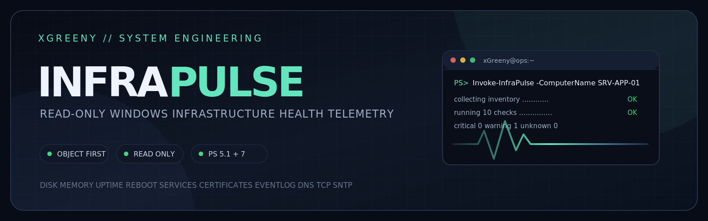
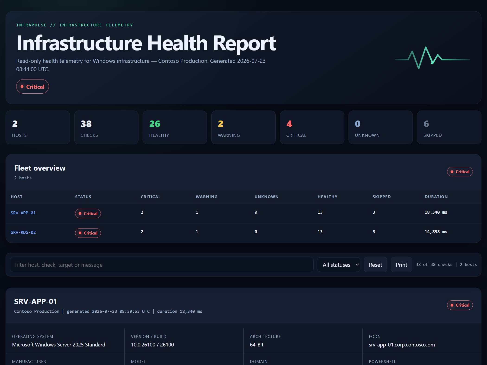
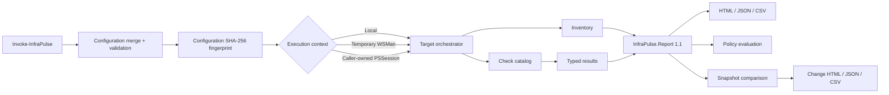

<p align="center">
  
</p>

<p align="center">
  <a href="https://github.com/xGreeny/infra-pulse/actions/workflows/ci.yml"></a>
  <a href="https://github.com/xGreeny/infra-pulse/releases"></a>
  <a href="https://www.powershellgallery.com/packages/InfraPulse"></a>
  
  <a href="LICENSE"></a>
</p>

# InfraPulse

**Read-only, change-aware infrastructure validation for Windows and hybrid environments.**

InfraPulse turns routine server validation into repeatable PowerShell checks, typed objects, self-contained reports, and defensible pre-change/post-change evidence. It is designed for maintenance windows, migrations, operational triage, and CI/CD gates—not as a replacement for continuous monitoring.

<p align="center">
  <a href="examples/sample-report.html"></a>
</p>

## Why InfraPulse

- Twelve built-in read-only checks for local or remote targets.
- Parallel multi-host scans with a configurable throttle and a fleet overview in the HTML report.
- Stable `InfraPulse.Report` and `InfraPulse.Result` objects instead of parsed console text.
- Validated configuration-as-code with deterministic deep merging and automatic discovery via `INFRAPULSE_CONFIG` or a working-directory `infra-pulse.psd1`.
- Searchable, self-contained HTML plus JSON and CSV exports.
- JSON report import with schema validation and type rehydration.
- Snapshot comparison that classifies regressions, resolved findings, and evidence changes.
- Reusable policy gates with blocking statuses, warning budgets, and wildcard ignore rules.
- Windows PowerShell 5.1 and PowerShell 7 support; cross-platform paths are tested on Linux.
- No third-party runtime modules and no target-state changes.

## Installation

InfraPulse is published to the [PowerShell Gallery](https://www.powershellgallery.com/packages/InfraPulse):

```powershell
# PSResourceGet (PowerShell 7.4+, or the Microsoft.PowerShell.PSResourceGet module)
Install-PSResource -Name InfraPulse

# PowerShellGet (Windows PowerShell 5.1 and PowerShell 7)
Install-Module -Name InfraPulse -Scope CurrentUser
```

Update later with `Update-PSResource InfraPulse` or `Update-Module InfraPulse`. To run from a source checkout instead, import the manifest directly:

```powershell
Import-Module .\src\InfraPulse\InfraPulse.psd1 -Force
```

## Quick start

```powershell
Import-Module InfraPulse

$report = Invoke-InfraPulse `
    -Check Disk, Memory, Uptime, PendingReboot

$report.Results |
    Where-Object Status -NotIn 'Healthy', 'Skipped' |
    Format-Table Status, CheckName, Target, Message -AutoSize

$report |
    Export-InfraPulseReport `
        -Path .\out\infra-pulse.html `
        -Force
```

The same object graph can be preserved for automation:

```powershell
$report | Export-InfraPulseReport -Path .\out\infra-pulse.json -Force
$report | Export-InfraPulseReport -Path .\out\infra-pulse.csv -Force
```

## Change validation workflow

Every report records a run identifier, UTC start/completion timestamps, a SHA-256 fingerprint of the effective configuration, the configuration source, and an optional environment label. That makes pre-change and post-change evidence comparable without treating different policies as equivalent.

```powershell
$before = Invoke-InfraPulse `
    -ComputerName 'srv-app-01' `
    -ConfigurationPath .\config\app-server.psd1

$before |
    Export-InfraPulseReport `
        -Path .\evidence\before.json `
        -Force

# Perform the approved infrastructure change.

$after = Invoke-InfraPulse `
    -ComputerName 'srv-app-01' `
    -ConfigurationPath .\config\app-server.psd1

$comparison = Compare-InfraPulseReport `
    -ReferenceObject $before `
    -DifferenceObject $after

$comparison |
    Export-InfraPulseComparison `
        -Path .\evidence\change-report.html `
        -Force
```

Comparison deltas are classified as:

| Change type | Meaning |
|---|---|
| `NewFinding` | A new warning, critical, or unknown result appeared. |
| `Regressed` | The result status became more severe. |
| `Resolved` | A previous warning, critical, or unknown result became healthy. |
| `Improved` | The result status improved without becoming healthy. |
| `Changed` | Status stayed the same, but relevant evidence or observed values changed. |
| `NotComparable` | A previous result is missing from the post-change run. |
| `Added` | A new healthy or skipped result appeared. |
| `Unchanged` | Status and relevant evidence stayed the same. |

Saved JSON reports can be restored as typed objects:

```powershell
$before = Import-InfraPulseReport .\evidence\before.json
$after  = Import-InfraPulseReport .\evidence\after.json

Compare-InfraPulseReport $before $after -ExcludeUnchanged
```

## Policy gates

Use `Test-InfraPulseReport` to apply a consistent release or change policy:

```powershell
$evaluation = $after |
    Test-InfraPulseReport `
        -FailOn Critical, Unknown `
        -MaximumWarnings 0

if (-not $evaluation.Passed) {
    throw $evaluation.Message
}
```

A reusable policy file keeps exceptions reviewable:

```powershell
@{
    SchemaVersion = '1.0'
    FailOn = @('Critical', 'Unknown')
    MaximumWarnings = 0

    Ignore = @(
        @{
            ComputerName = 'lab-*'
            CheckName    = 'Uptime'
            Target       = '*'
            Status       = 'Warning'
        }
    )
}
```

```powershell
$after |
    Test-InfraPulseReport `
        -PolicyPath .\config\change-policy.example.psd1 `
        -ThrowOnFailure
```

`Test-InfraPulseReport` returns an `InfraPulse.PolicyEvaluation` object. It never exits the PowerShell host process and throws only when `-ThrowOnFailure` is explicitly requested.

Comparisons gate the same way: `Test-InfraPulseComparison` blocks on `NewFinding` and `Regressed` changes by default, turning a pre-change/post-change comparison into a deterministic regression gate:

```powershell
Compare-InfraPulseReport $before $after | Test-InfraPulseComparison -ThrowOnFailure
```

## Built-in checks

| Check | Default | Platform | Evaluation |
|---|:---:|---|---|
| `Disk` | On | Windows | Fixed-volume free percentage and free GiB using unrounded values |
| `Memory` | On | Windows | Available physical memory percentage |
| `Uptime` | On | Windows | Time since the last operating-system boot |
| `PendingReboot` | On | Windows | Servicing, Windows Update, rename, and Configuration Manager indicators |
| `PatchAge` | On | Windows | Days since the most recent installed Windows update |
| `Services` | On | Windows | Required service existence and expected state; collection failures remain `Unknown` |
| `Certificates` | On | Windows | Expired and expiring machine certificates; auto-rotating short-lived certificates stay healthy while valid |
| `EventLog` | On | Windows | Recent critical/error volume, top providers, and optional samples |
| `Dns` | On | Cross-platform | Configured DNS names and record types; skipped until targets are defined |
| `Tcp` | On | Cross-platform | Configured host/port reachability; skipped until endpoints are defined |
| `Tls` | On | Cross-platform | TLS handshake, identity, chain trust, negotiated protocol, and expiry |
| `TimeSync` | Off | Cross-platform | SNTP offset and round-trip time against configured NTP servers |

```powershell
Get-InfraPulseCheck
```

### TLS endpoint validation

The TCP check intentionally validates listener reachability only. The TLS check adds certificate and protocol evidence:

```powershell
@{
    Checks = @{
        Tls = @{
            WarningDays         = 30
            CriticalDays        = 14
            RequireTrustedChain = $true
            RequireNameMatch    = $true

            Endpoints = @(
                @{
                    Name = 'Application portal'
                    Host = 'portal.contoso.invalid'
                    Port = 443
                    Sni  = 'portal.contoso.invalid'
                }
            )
        }
    }
}
```

The check captures the certificate subject, issuer, thumbprint, validity window, DNS identity, trust-chain result, policy errors, negotiated TLS protocol, and handshake duration.

## Configuration as code

Generate and validate a complete configuration before contacting a target:

```powershell
New-InfraPulseConfiguration -Path .\config\my-environment.psd1
Test-InfraPulseConfiguration -Path .\config\my-environment.psd1

Invoke-InfraPulse -ConfigurationPath .\config\my-environment.psd1
```

A partial role override stays concise because it is merged with versioned defaults:

```powershell
@{
    SchemaVersion = '1.0'

    General = @{
        EnvironmentName = 'Kunde XYZ'

        DefaultChecks = @(
            'Disk'
            'Memory'
            'Uptime'
            'PendingReboot'
            'Services'
            'Dns'
            'Tcp'
            'Tls'
        )
    }

    Checks = @{
        Disk = @{
            WarningFreePercent  = 18
            CriticalFreePercent = 8
            WarningFreeGB       = 30
            CriticalFreeGB      = 12

            # Large data volumes: per-volume overrides beat the global thresholds.
            Volumes = @(
                @{ DeviceId = 'D:'; WarningFreePercent = 10; CriticalFreePercent = 5 }
            )
        }

        Services = @{
            Required = @(
                @{ Name = 'EventLog'; ExpectedStatus = 'Running'; Severity = 'Critical' }
                @{ Name = 'W32Time';  ExpectedStatus = 'Running'; Severity = 'Warning'  }
            )
        }
    }
}
```

Dictionaries merge recursively. Scalars and arrays replace defaults. The complete schema is documented in [`docs/configuration.md`](docs/configuration.md).

## Remote scans

InfraPulse can create temporary WSMan sessions. Multiple targets are scanned in parallel runspaces (default throttle 8, tunable with `-ThrottleLimit`; `-FailFast` forces sequential processing):

```powershell
$credential = Get-Credential

$reports = Invoke-InfraPulse `
    -ComputerName 'srv-app-01', 'srv-file-01' `
    -Credential $credential `
    -UseSSL `
    -ConfigurationPath .\config\infra-pulse.example.psd1 `
    -Tag 'production', 'maintenance-window'

$reports |
    Export-InfraPulseReport `
        -Path .\out\production-health.html `
        -Force
```

Caller-owned sessions keep transport, authentication, endpoint configuration, and lifecycle under operator control:

```powershell
$sessions = New-PSSession `
    -ComputerName 'srv-app-01', 'srv-file-01' `
    -Credential $credential

try {
    $sessions | Invoke-InfraPulse -Check Disk, Memory, Services
}
finally {
    $sessions | Remove-PSSession
}
```

InfraPulse closes only sessions it creates. See [`docs/remoting.md`](docs/remoting.md) for prerequisites and least-privilege guidance.

## Status model

| Status | Meaning |
|---|---|
| `Healthy` | The observed value is inside the configured operating threshold. |
| `Warning` | Attention is required, but the critical threshold has not been reached. |
| `Critical` | The critical threshold was reached or a required dependency is unavailable. |
| `Unknown` | Collection or evaluation could not establish a defensible health state. |
| `Skipped` | The check is not applicable or has no configured targets. |

Report precedence is `Critical` → `Warning` → `Unknown` → `Healthy` → `Skipped`.

## Report contracts

InfraPulse deliberately keeps data separate from display formatting. Report schema 1.3 carries run identity, configuration provenance, and the environment label:

```text
RunId
StartedAtUtc
CompletedAtUtc
ConfigurationFingerprint
ConfigurationSource
EnvironmentName
```

Schema 1.0 through 1.2 JSON reports remain importable. Details are documented in [`docs/report-schema.md`](docs/report-schema.md).

## Security boundaries

InfraPulse is intentionally read-only. It queries state through CIM/WMI, the Service Control Manager, the certificate provider, `Get-WinEvent`, DNS, TCP sockets, TLS, and SNTP. It does not restart services, delete files, renew certificates, clear event logs, alter firewall rules, or remediate findings.

Generated reports can contain hostnames, domain names, certificate identities, service names, event providers, and optional event-message excerpts. Protect them as operational data and sanitize them before sharing outside the intended boundary.

Credentials are passed directly to `New-PSSession` and are never persisted in configuration or reports.

## Architecture



Implementation details are covered in [`docs/architecture.md`](docs/architecture.md).

## Compatibility

| Component | Supported baseline |
|---|---|
| Controller | Windows PowerShell 5.1 or PowerShell 7+ |
| Windows target | Windows with PowerShell remoting and built-in interfaces required by selected checks |
| Cross-platform target | PowerShell 7+ for DNS, TCP, TLS, and SNTP checks |
| InfraPulse-created transport | WSMan/WinRM through `New-PSSession -ComputerName` |
| Caller-owned sessions | Any working `PSSession` accepted by the controller PowerShell version |

CI validates Windows PowerShell 5.1, PowerShell 7 on Windows, and PowerShell 7 on Linux. It runs parser validation, manifest checks, PSScriptAnalyzer, Pester, code coverage collection, package extraction, manifest verification, and SHA-256 generation.

## Development

```powershell
.\build.ps1 -Task Verify -Bootstrap
```

| Task | Purpose |
|---|---|
| `Clean` | Removes generated output and test results. |
| `Analyze` | Parses PowerShell and format files, validates the manifest, and runs PSScriptAnalyzer. |
| `Test` | Executes Pester unit/integration tests and writes NUnit plus JaCoCo coverage XML. |
| `Package` | Creates `out/InfraPulse-<version>.zip` and a SHA-256 file. |
| `Verify` | Runs analysis, tests, and packaging in sequence. |

```text
infra-pulse/
├── src/InfraPulse/          # Module manifest, public commands, private implementation
├── config/                  # Validated configuration and policy examples
├── examples/                # Local, remote, scheduled, change, and CI-gate usage
├── docs/                    # Architecture and operator documentation
├── tests/                   # Pester unit and integration tests
├── tools/                   # Development utilities
├── .github/workflows/       # CI and tagged-release automation
└── build.ps1                # Repeatable verification and packaging entry point
```

See [`CONTRIBUTING.md`](CONTRIBUTING.md) for the change workflow and [`SECURITY.md`](SECURITY.md) for responsible vulnerability reporting.

## License

InfraPulse is licensed under the [MIT License](LICENSE).
