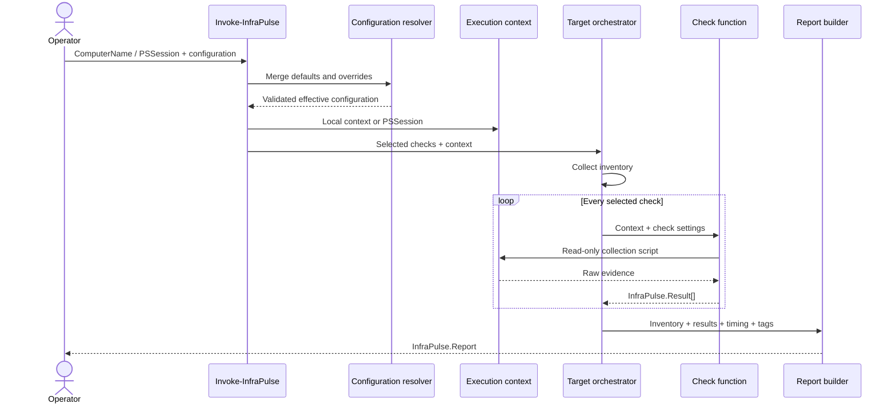

# Architecture

InfraPulse is a PowerShell module with a deliberately small public surface and a strict separation between orchestration, collection, evaluation, and presentation.

## Design goals

1. **Read-only execution** — checks collect and evaluate state; they never remediate it.
2. **Object-first output** — automation consumes stable objects rather than screen text.
3. **Deterministic configuration** — partial overrides are deep-merged with versioned defaults and validated before any target is contacted.
4. **Transport independence at the check layer** — each check receives an execution context and uses the same command wrapper locally or through a PSSession.
5. **Failure isolation** — a failed check becomes an `Unknown` result when `ContinueOnError` is enabled; it does not erase successful evidence from other checks.
6. **PowerShell 5.1 compatibility** — Windows Server estates can use the module without first deploying PowerShell 7.

## Execution path



## Module layout

```text
src/InfraPulse/
├── InfraPulse.psd1             # Version, metadata, exported surface
├── InfraPulse.psm1             # Strict-mode loader
├── Public/                     # Exported commands
├── Private/                    # Configuration, orchestration, checks, reporting
└── Formats/InfraPulse.Format.ps1xml
```

The module loader dot-sources private scripts before public scripts and exports only the base names of files under `Public/`. The manifest contains the same explicit export list. CI verifies both surfaces match.

## Configuration pipeline

`Resolve-InfraPulseConfiguration` performs four steps:

1. Accept a `.psd1` file or in-memory dictionary, never both.
2. Load the versioned defaults from `Get-DefaultInfraPulseConfiguration`.
3. Deep-copy and recursively merge the override.
4. Validate the effective configuration through `Test-InfraPulseConfigurationData`.

Arrays replace defaults rather than append to them. This is intentional: required services, endpoints, exclusions, and target lists must remain predictable.

## Execution context

Checks receive a context object with:

| Property | Purpose |
|---|---|
| `RequestedComputerName` | Name supplied by the operator or caller-owned session |
| `ComputerName` | Canonical name discovered from target inventory when available |
| `Session` | `PSSession` or `$null` for local execution |
| `OwnsSession` | Records lifecycle ownership; caller-owned sessions are never removed |

`Invoke-InfraPulseCommand` is the only local/remote branching point used by checks. Collection script blocks therefore execute on the evaluated host, which is essential for DNS, TCP, certificate-store, registry, and event-log observations.

## Check contract

A check function follows this signature:

```powershell
function Invoke-InfraPulseExampleCheck {
    [CmdletBinding()]
    param(
        [Parameter(Mandatory)]
        [psobject]$Context,

        [Parameter(Mandatory)]
        [System.Collections.IDictionary]$Settings
    )

    # Collect raw data through Invoke-InfraPulseCommand.
    # Evaluate thresholds on the controller.
    # Return one or more InfraPulse.Result objects.
}
```

Every catalog entry defines a name, category, function name, Windows requirement, and description. Adding a check requires coordinated changes to:

- `Get-InfraPulseCheckCatalog`
- `Get-DefaultInfraPulseConfiguration`
- `Test-InfraPulseConfigurationData`
- `Get-InfraPulseConfigurationTemplate`
- `Invoke-InfraPulse` parameter validation
- check documentation and Pester tests

## Failure semantics

InfraPulse distinguishes collection health from infrastructure health:

- **Connection failure**: a `Critical` control result because the target cannot be assessed through the requested transport.
- **Check failure**: an `Unknown` result because no defensible infrastructure state can be inferred.
- **Non-applicable check**: a `Skipped` result.
- **Fail-fast mode**: the original exception is rethrown.

`General.ContinueOnError = $false` has the same stop-on-error effect as `-FailFast`, while `-FailFast` provides an operator-level override without editing configuration.

## Report and presentation layers

`New-InfraPulseResult` and `New-InfraPulseReport` create ordered custom objects and prepend stable type names. Formatting is defined separately in `InfraPulse.Format.ps1xml`.

`Export-InfraPulseReport` supports:

- HTML: one self-contained document with inline CSS, inline JavaScript, search, status filtering, evidence expansion, and print styles.
- JSON: full report object graph with evidence.
- CSV: one flattened row per check result; nested evidence is preserved as JSON in `EvidenceJson`.

No external fonts, stylesheets, scripts, or analytics are loaded by the HTML report.
